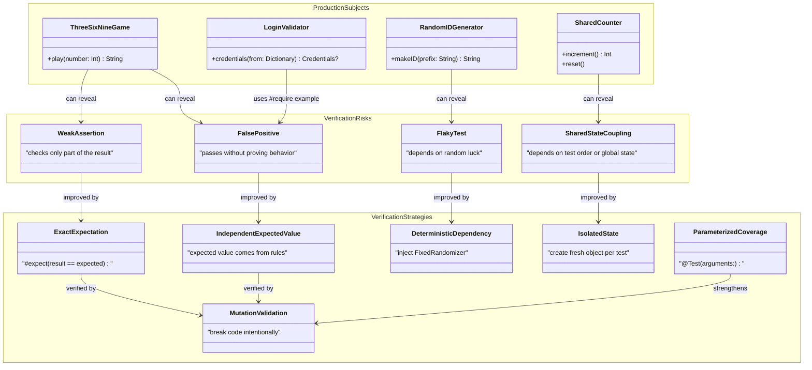

# Test Verification with Swift Testing

| Item | Content |
| --- | --- |
| Research Idea | Swift Testing |
| Essential Question | How can tests be validated to ensure they are actually working correctly when using Swift Testing? |
| Challenge Statement | Design and evaluate testing approaches using Swift Testing to ensure tests behave correctly by comparing success and failure cases |
| Challenge Response | Investigate how tests can be verified using Apple's Swift Testing framework. The goal is not only to write passing tests, but to ask whether those tests would fail when the production code is wrong. |
                                
## Research Background

Passing tests can still give false confidence. A test may pass because its assertion is too weak, because it never exercises the production code, because it repeats the same logic as the implementation, or because it depends on randomness or shared mutable state.

This project explores test verification: the practice of checking whether tests can actually detect realistic bugs. Instead of only asking "does the test pass?", this lab asks "would this test fail if the production code were intentionally broken?"

The project uses Swift Testing rather than XCTest so the experiments can focus on modern Swift test syntax such as `@Suite`, `@Test`, `#expect`, `#require`, and `@Test(arguments:)`.

## Objective

The objective is to design a small Swift Package that demonstrates how test quality can be evaluated.

The lab investigates:

- Weak assertions that miss incorrect behavior
- False positives where tests pass without proving production behavior
- Flaky tests caused by randomness
- Hidden coupling caused by shared mutable state
- Parameterized tests for broader coverage
- Mutation validation as a way to check whether tests catch bugs

Success is measured by whether the test suite passes by default and whether the documented mutations would be caught by stronger tests.

## Methodology

The methodology is organized by **test verification risk**, not by file location. A diagram grouped only by `Sources` and `Tests` shows where files live, but it does not clearly show why each experiment matters. Grouping by risk makes the testing lesson easier to see:

- What can make a test misleading?
- Which production type demonstrates that risk?
- Which test suite shows the weak version?
- Which test suite shows the stronger verification strategy?

The experiment process is:

1. Implement simple production behavior in the Swift Package.
2. Write tests that pass by default.
3. Add examples of weak or misleading tests.
4. Add stronger alternatives that verify exact behavior.
5. Document intentional mutations, such as treating `8` as a clap digit.
6. Identify which tests catch the mutation and which tests fail to detect it.

Detailed experiment notes are in [`testing-lab-verification/Docs/verification-tests.md`](testing-lab-verification/Docs/verification-tests.md).
