# Test Verification with Swift Testing

## Project Purpose

This package is a small testing lab. It is not an iOS app and it does not launch a screen. Instead, it separates simple Swift logic into a package so the behavior can be tested quickly with `swift test`.

The package asks one question:

> Passing tests are nice, but how do we know the tests would fail when the code is wrong?

## How to Run

From the package root:

```bash
cd VerificationTestingLab/testing-lab-verification
swift test
```

The important files are:

- `Sources/VerificationTestingLab`: production code being tested
- `Tests/VerificationTestingLabTests`: Swift Testing test suites
- `Docs/verification-tests.md`: notes about what each experiment demonstrates

## Essential Question

How can tests be validated to ensure they are actually working correctly when using Swift Testing?

## Challenge

Investigate how trustworthy tests can be designed using Apple's Swift Testing framework. The goal is not only to write passing tests, but to ask whether those tests would fail when the production code is wrong.

## Methodology

This lab separates the code into three conceptual layers:

1. Production layer: small Swift types that contain behavior.
2. Test layer: Swift Testing suites that exercise the behavior.
3. Testing foundation: Swift Testing tools such as `@Suite`, `@Test`, `#expect`, `#require`, and `@Test(arguments:)`.

The methodology is:

1. Write simple production behavior.
2. Write tests that pass.
3. Question whether those tests are strong enough.
4. Introduce realistic mistakes as disabled tests, comments, or temporary mutations.
5. Check which tests would catch the mistake.
6. Improve tests by making them exact, deterministic, isolated, and independent from implementation logic.

```mermaid
classDiagram
    namespace Production {
        class ThreeSixNineGame {
            +play(number: Int) String
        }

        class LoginValidator {
            +isValid(username: String, password: String) Bool
            +credentials(from: Dictionary) Credentials?
        }

        class RandomIDGenerator {
            -randomizer: IntegerRandomizing
            +makeID(prefix: String) String
            +parseNumber(from: String) Int?
        }

        class IntegerRandomizing {
            <<protocol>>
            +nextInt(in: ClosedRange~Int~) Int
        }

        class SystemRandomizer {
            +nextInt(in: ClosedRange~Int~) Int
        }

        class FixedRandomizer {
            -value: Int
            +nextInt(in: ClosedRange~Int~) Int
        }

        class SharedCounter {
            +shared: SharedCounter
            -value: Int
            +increment() Int
            +currentValue() Int
            +reset()
        }
    }

    namespace TestLayer {
        class WeakAssertionTests
        class FalsePositiveTests
        class FlakyTests
        class SharedMutableStateTests
        class ParameterizedTests
        class TestValidationChecklistTests
    }

    namespace SwiftTesting {
        class Suite {
            <<attribute>>
        }
        class Test {
            <<attribute>>
        }
        class Expect {
            <<macro>>
        }
        class Require {
            <<macro>>
        }
    }

    SystemRandomizer ..|> IntegerRandomizing
    FixedRandomizer ..|> IntegerRandomizing
    RandomIDGenerator --> IntegerRandomizing : has

    WeakAssertionTests --> ThreeSixNineGame : tests
    FalsePositiveTests --> ThreeSixNineGame : tests
    FalsePositiveTests --> LoginValidator : tests
    FlakyTests --> RandomIDGenerator : tests
    FlakyTests --> FixedRandomizer : injects
    SharedMutableStateTests --> SharedCounter : tests
    ParameterizedTests --> ThreeSixNineGame : tests
    TestValidationChecklistTests --> ThreeSixNineGame : validates mutations
    TestValidationChecklistTests --> RandomIDGenerator : checks determinism
    TestValidationChecklistTests --> SharedCounter : checks isolation

    WeakAssertionTests ..> Suite : uses
    WeakAssertionTests ..> Test : uses
    WeakAssertionTests ..> Expect : uses
    FalsePositiveTests ..> Require : uses
    FlakyTests ..> Require : uses
    ParameterizedTests ..> Test : uses arguments
```



## Useful Swift Testing Terms

- `@Suite`: groups related tests.
- `@Test`: marks a function as a test.
- `@Test(arguments:)`: runs the same test once for each argument row.
- `#expect`: checks that a condition is true, but allows the test function to continue.
- `#require`: unwraps a required value. If the value is `nil`, the test fails immediately.

Tests should be independent. A suite groups tests by topic, but tests inside one suite should not depend on being run in the order they appear in the file.

## Experiments

### 1. Weak Assertions

A weak assertion checks only part of the result:

```swift
#expect(result.contains("clap"))
```

That can pass for both `"clap"` and `"clap clap"`, so it misses a bug where double-clap numbers produce only one clap.

A stronger assertion checks the exact behavior:

```swift
#expect(result == "clap clap")
```

### 2. False Positives

False positives happen when a test passes without proving the behavior. Two common examples are:

- The test never calls the system under test.
- The expected value is generated with the same logic as the production code.

In this lab, false positive means:

> The production code can be wrong, but the test still passes.

Expected values should come from the rules, examples, or requirements, not from copying the implementation.

Weak example:

```swift
let expected = "clap clap"
#expect(expected == "clap clap")
```

This test never calls `ThreeSixNineGame.play(_:)`, so it cannot prove anything about the game.

Stronger example:

```swift
let result = ThreeSixNineGame().play(99)
#expect(result == "clap clap")
```

This test exercises the system under test and compares it to an independently chosen expected value.

### 3. Flaky Tests

Flaky tests pass or fail for reasons unrelated to code changes. A test that expects `RandomIDGenerator()` to produce one exact random value is unreliable.

This lab keeps the flaky example as a disabled test:

```swift
@Test(
    "Disabled flaky example: exact random output is unreliable",
    .disabled("Re-enable to see that this test only passes when the random value happens to be 1234.")
)
func disabledFlakyExample() {
    let id = RandomIDGenerator().makeID()
    #expect(id == "user-1234")
}
```

It is disabled so the normal verification run remains stable, while the failing test body is still visible.

The improved design injects randomness:

```swift
let generator = RandomIDGenerator(randomizer: FixedRandomizer(1234))
#expect(generator.makeID() == "user-1234")
```

Deterministic tests improve reliability because a failure points to a real behavior change.

Another valid approach is to keep randomness but check only stable properties:

```swift
#expect(id.hasPrefix("user-"))
#expect((1000...9999).contains(number))
```

This does not guess the exact random number. It checks rules that should be true for every generated ID.

### 4. Shared Mutable State

Shared state can create hidden coupling. If one test increments `SharedCounter.shared`, another test can pass or fail depending on test order.

Tests should not depend on the order they are written in. Even when multiple `@Test` functions are inside the same `@Suite` or `struct`, each test must be able to pass on its own. A suite groups related tests, but it should not be treated like an ordered script.

Avoid this pattern:

```swift
@Test func firstTest() {
    SharedCounter.shared.reset()
    #expect(SharedCounter.shared.increment() == 1)
}

@Test func secondTest() {
    #expect(SharedCounter.shared.increment() == 2)
}
```

`secondTest` only passes if `firstTest` ran before it. That creates an order-dependent test.

In the test suite, this risk is represented with disabled tests. They are real test functions, but skipped during normal verification so failure examples do not run accidentally.

Prefer isolated state:

```swift
let counter = SharedCounter()
#expect(counter.increment() == 1)
```

If shared state is unavoidable, reset it inside the test that uses it. This is still a weaker option than isolated state because reset calls can be forgotten, and parallel tests can still interfere with each other.

### 5. Parameterized Tests

Swift Testing supports tables of examples with `@Test(arguments:)`. This improves coverage while keeping tests readable:

```swift
@Test(arguments: [
    PlayCase(number: 1, expected: "1"),
    PlayCase(number: 3, expected: "clap"),
    PlayCase(number: 33, expected: "clap clap")
])
func playReturnsExpectedValue(sample: PlayCase) {
    #expect(ThreeSixNineGame().play(sample.number) == sample.expected)
}
```

Parameterized tests make it easier to cover normal cases, edge cases, and regression cases.

Each argument row is reported as its own test case. That makes it easier to see which input failed.

### 6. Mutation Validation

Mutation validation means intentionally breaking production code and checking whether tests fail.

Example mutation:

```swift
// BUG:
// Treat digit 8 as a clap digit.
```

Broken logic:

```swift
digit == "3" || digit == "6" || digit == "8"
```

Correct logic:

```swift
digit == "3" || digit == "6" || digit == "9"
```

Tests that catch this mutation:

- Exact tests for `9 -> "clap"` and `99 -> "clap clap"`
- Exact tests for `8 -> "8"` and `88 -> "88"`
- Parameterized cases such as `(28, "28")`

Tests that may not catch this mutation:

- Tests that only check `.contains("clap")`
- Tests that never call `ThreeSixNineGame.play(_:)`
- Tests that calculate expected values by copying production logic

To try this manually:

1. Open `Sources/VerificationTestingLab/ThreeSixNineGame.swift`.
2. Temporarily change the clap digits from `3, 6, 9` to `3, 6, 8`.
3. Run `swift test`.
4. Confirm that the stronger tests fail.
5. Change the code back to `3, 6, 9`.

This is how we verify that the tests are not just passing, but actually capable of catching bugs.

## Findings

Trustworthy tests are designed to fail for the right reasons. Passing is not enough. A good test should prove that the production behavior matches the rule, and it should become red when that rule is intentionally broken.

The most useful patterns were:

- Assert exact behavior instead of vague properties when exact behavior matters.
- Exercise the real system under test.
- Keep expected values independent from implementation logic.
- Inject nondeterministic dependencies such as randomness.
- Avoid shared mutable state between tests.
- Do not depend on test execution order, even inside one suite.
- Use parameterized tests to cover many independent examples.
- Validate tests by trying small intentional mutations.

## Trustworthy Test Checklist

- Does the test fail when production code is intentionally broken?
- Does it verify exact behavior?
- Does it call the real system under test?
- Is expected data independent from implementation?
- Is the test deterministic?
- Is it isolated from other tests?
- Would it still pass if run alone or in a different order?
- Does the test name clearly describe behavior?
- Are edge cases covered?
- Would failure messages help identify the bug?

## Beginner Summary

A trustworthy test should answer three questions:

1. Did I call the real code I meant to test?
2. Did I compare the result to an expected value from the requirement, not from copied implementation logic?
3. Would this test fail if I intentionally introduced a realistic bug?

If the answer to any of these is "no", the test may be giving false confidence.
